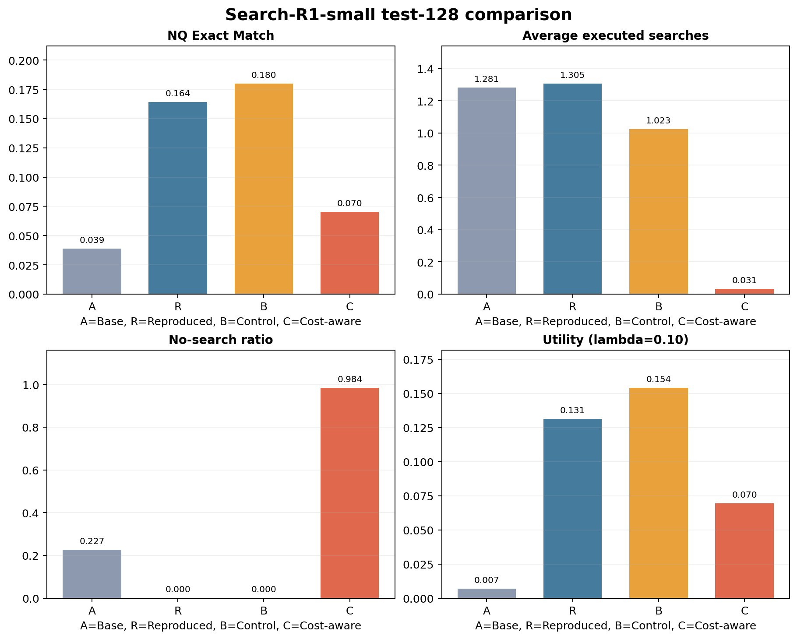
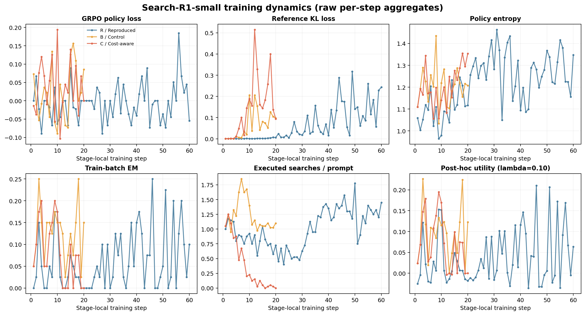

# Search-R1-small 实验结果（2026-07-20）

## 结论

本轮工程流水线完整成功：两级 gate、R60、B20、C20 和 A/R/B/C 的同一份 NQ test-128 评测均以 `exit-code=0` 结束，结果包哈希通过。A 到 R 的 EM 从 3.91% 提升到 16.41%，说明缩小版 Search-R1 训练确实学到了更有效的搜索回答行为。

成本感知实验得到的是有效负结果。与同起点、同训练量的 B 相比，C 将平均检索次数降低 96.95%，但 EM 从 17.97% 降到 7.03%，统一 utility 也从 0.1541 降到 0.0695。`lambda=0.10` 在当前单 seed、小数据、20-step 设置下诱发了“几乎不搜索”的策略退化，不能宣称成本优化成功。

## 固定实验配置

| 项目 | 配置 |
| --- | --- |
| 模型与训练 | Qwen3.5-2B，全参数 FSDP，bf16 |
| 数据 | NQ train-512 / val-64 / test-128，seed 42 |
| Agent | CPU BM25 top-3，最多 4 次真实检索 |
| GRPO | batch 8，group size 5，每 step 40 条轨迹 |
| 路径 | A -> R60；同一 R60 -> B20 / C20 |
| 唯一 B/C 变量 | B：`lambda=0`；C：`lambda=0.10` |
| 统一指标 | `utility = EM - 0.10 * avg_searches / 4` |
| 硬件 | 2 张 RTX 5090 级 GPU，整机 5.76 元/小时 |
| 代码 | commit `345ad0d260f09fbe81dbd4626e7744c42b1ee273` |

## Test-128 结果

| 阶段 | 答对数 | EM | 平均检索 | 不检索比例 | Utility |
| --- | ---: | ---: | ---: | ---: | ---: |
| A / Base | 5/128 | 0.0391 | 1.2813 | 0.2266 | 0.0070 |
| R / Reproduced | 21/128 | 0.1641 | 1.3047 | 0.0000 | 0.1314 |
| B / Control | 23/128 | 0.1797 | 1.0234 | 0.0000 | 0.1541 |
| C / Cost-aware | 9/128 | 0.0703 | 0.0313 | 0.9844 | 0.0695 |

关键差值：

- A -> R：多答对 16 题，EM 增加 12.50 个百分点；这是复现 sanity check，不是与论文大规模结果的数值对齐。
- R -> B：相同原奖励再训练 20 steps 后多答对 2 题，平均检索减少 0.2813，utility 增加 0.0227。
- B -> C：平均检索减少 0.9922，但少答对 14 题，EM 降低 10.94 个百分点，utility 降低 0.0846（54.88%）。

## 训练动态与诊断

B/C 使用同一个 R60 parent、相同 seed 和配置。分叉前两步的 prompt、序列长度与检索行为一致，成本项已经令梯度方向和尺度出现差异。C 的前 5 步平均每题检索 1.025 次、batch EM 为 0.115；最后 5 步分别变为 0.020 次和 0.030，不检索比例升至 98.5%。最后一步的训练 batch 已完全不检索，test-128 也有 126/128 题不检索。

一种与曲线一致但未经逐轨迹验证的解释是：EM 是稀疏的二元结果信号，而搜索成本可能在更多采样轨迹间提供可区分信号，使 GRPO 更快学会避免调用工具。在小数据、单 seed 和短二阶段训练下，策略先学会“省调用”，却没有保住依赖检索的答案质量。现有聚合日志不能观测组内 reward/advantage 方差，因此这只是诊断假设，不是已证实的因果机制。C 的 wall time 比 B 少 30.69% 主要是退化后生成轨迹更短，不代表训练系统本身优化了 30%。

## 成本与证据

R、B、C 各自记录的训练费用分别为 36.02、11.98 和 8.30 元。完整 GPU phase 从约 14:06 到次日 01:41，约 11 小时 35 分；按整机价格估算约 66.69 元，包含 gate、四次评测和阶段开销，但不包含 CPU、存储及控制台计费误差。

权威数据见 [results.csv](results.csv)，父子 checkpoint 和 digest 见 [lineage.tsv](lineage.tsv)，逐 step 聚合指标见 [training_metrics.csv](training_metrics.csv)。原始比较文件由 [comparison.sha256](comparison.sha256) 封存，导出曲线由 [generated.sha256](generated.sha256) 封存。GPU attempt 绑定的最终结果 digest 为 `fb6f059b092171ced19b225f1ec6759a16c6cf3a208a3a55beb25d773b0081d0`。

完整日志、resolved config、WandB offline、终态和 manifest 另存为 `tmp/search-r1-small-20260720-evidence.tar.gz`，SHA-256 为 `a4cc0127b15098fcfca9e09026508160b37fc98683857d2dc127385edb5970f7`。该本地归档不含 checkpoint 权重；正式权重继续保存在 AutoDL 数据盘。

## 结论边界与面试表述

本实验只有一个 seed、128 道测试题和聚合日志，没有逐题预测，因此不能做 paired bootstrap、错误类型分析或统计显著性声明。不要表述为“成本感知奖励提高了效果”或“无损减少调用”。更准确的简历表述是：

> 在 Qwen3.5-2B 上完成 Search-R1-small 的检索 Agent 与 GRPO 复现，使 NQ test-128 EM 从 3.9% 提升到 16.4%；设计同起点成本奖励对照，观察到 97.0% 的检索下降伴随策略退化，并通过训练曲线识别 no-search collapse，提出稀疏正确性信号与成本信号失衡的诊断假设。

按预注册方案，本轮不事后挑 checkpoint、不单边延长 C，也不自动做 lambda sweep。若开展后续实验，应先固定新的成功标准和更小 `lambda`，再运行一组独立、明确标记为 follow-up 的对照。
